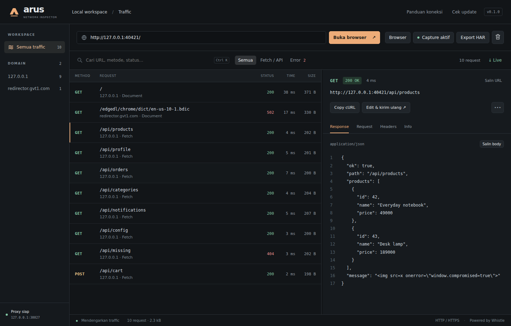
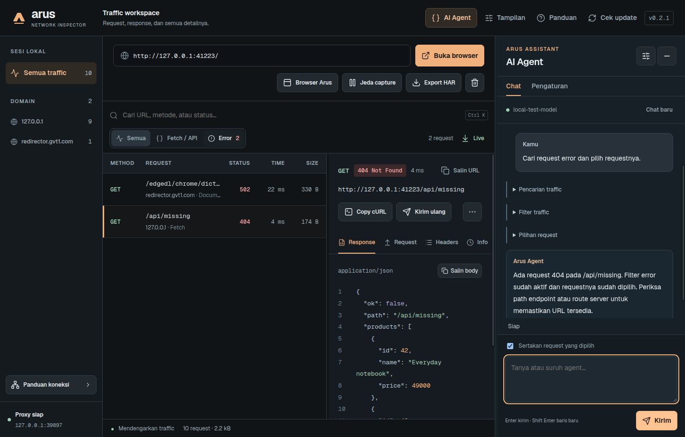

# Arus

A focused desktop HTTP / HTTPS traffic inspector for Windows. Built with Electron and powered by [Whistle](https://github.com/avwo/whistle).



## Download

Get **Arus-Setup-VERSION.exe** from [Releases](https://github.com/diemasmahendra/arus-inspector/releases). Installers are published after the GitHub Actions build and packaged Windows tests succeed. Windows x64 is the initial supported target.

## Getting started

1. Install and open Arus.
2. Enter a website URL, select **Browser Arus** or **Camoufox**, and click **Buka browser**. Camoufox downloads its separate engine from the upstream project on first use; later launches reuse it.
3. Use that browser normally. Select a captured request to inspect its headers, body, and response.

The built-in browser trusts only the local Arus capture CA within its own session. Arus does not change your system proxy or install a system certificate automatically. The upstream proxy validates server TLS certificates.

To connect another browser: open **Panduan**, set its HTTP and HTTPS proxy to the shown loopback address, and import the exported CA into that browser's trust store for HTTPS inspection. The port may change on restart. Restore proxy settings and remove the CA when finished.

## Features

- Live HTTP / HTTPS capture through a local Whistle proxy.
- Domain, API, error, and free-text filters.
- Request / response bodies, headers, metadata, and pretty JSON.
- Resizable inspector, keyboard navigation, Ctrl+K search, Space to pause/resume.
- Copy cURL (redacted by default, full copy available with confirmation).
- Edit and replay requests with a 30-second timeout and no automatic browser cookies. Redirects are not followed. Browser-managed Sec-* metadata and transport headers are rebuilt by Chromium; other explicit request headers are retained.
- HAR export. Standard export redacts known sensitive headers and query parameters, omits bodies. Full export requires confirmation. Review any export before sharing: arbitrary headers and URL path segments can contain sensitive data.
- GitHub Releases update checks, download progress, and restart-to-install.
- AI chat and controlled application tools, with five editable Markdown profiles.
- Offline Geist fonts, Lucide icons, and three display sizes.

## Privacy and limits

No telemetry or account is implemented. Capture records are kept in memory, bounded to 3,000 records / 48 MiB; older records are removed. Body views are limited to 1 MiB. Whistle also maintains a bounded temporary capture cache. Its generated CA/private key and settings are stored in the app's private data directory on the machine; never commit or share that directory.

Pause stops recording into Arus; the proxy continues forwarding traffic. Closing Arus stops its proxy. Browser Arus has a tab bar, new/close tab buttons, address bar, back/forward, reload/stop, and Ctrl+T/W/L/Tab shortcuts. Every tab shares the capture session. Popup windows retain opener communication and the same captured session. Use the + button or Ctrl+T to open regular tabs. Blank-window flows, opener communication, and links/forms targeting a new window are supported. Downloads and device permissions are disabled in the capture browser. Browser sessions are temporary. **Tutup browser** closes the selected browser without allowing pages to hold it open. Camoufox uses a separate Firefox process through camoufox-js/Playwright, with the same local capture proxy, popup session, and upstream TLS verification. HTTPS certificate exceptions are confined to its temporary capture context; no system trust or proxy changes are made. This is a debugging browser, not a replacement for your daily browser.

Arus does not display WebSocket frames, SSE streams, gRPC/protobuf decoding, Android patching, or traffic that bypasses the configured proxy. Some sites reject embedded Chromium browsers. Apps using certificate pinning may reject the proxy CA.

See [SECURITY.md](SECURITY.md) for the known upstream node-forge advisory and current exposure assessment.

The Windows installer is unsigned. Windows may show an unknown-publisher/SmartScreen message. Release assets include update metadata with SHA-512 checksums; code signing requires a signing certificate and is not configured in this repository yet. Updates are not downloaded or installed without clicking the relevant action.

## Development

Node.js 24 and npm:

```sh
npm ci
npm start
npm test
npm run check
npm run dist
```

The Windows release workflow also runs the integration tests against the packaged executable before publishing. Desktop integration tests require a graphical desktop (on headless Linux: `xvfb-run -a npm run test:e2e`). Test browsers visit local fixtures only. Traffic capture tests verify HTTP, HTTPS, rejection of untrusted upstream TLS, and clear-session behavior.

## Updates and releases

Pushes to `main` run tests, build the Windows installer, and publish a new GitHub Release **only when that version has not already been released**. To ship a change:

```sh
npm version patch --no-git-tag-version
git add package.json package-lock.json
git commit -m "Release next version"
git push origin main
```

The workflow publishes the installer, blockmap, and `latest.yml` update metadata. GitHub Actions must be enabled and allowed to write repository contents. Existing versions are never silently replaced; increase the version for each release.

MIT license. See [third-party notices](THIRD_PARTY_NOTICES.md).

## AI Agent (v0.2)



[Markdown profile settings](docs/agent-settings.png)

Open **AI Agent → Pengaturan** and enter a base URL, model name, and optional API key for an OpenAI-compatible **Chat Completions endpoint with tool calling**. The base URL must include the API prefix (for example `http://127.0.0.1:20128/v1`). HTTPS is required for remote providers; HTTP is allowed only on loopback. Arus adds `/chat/completions`. No provider subscription or model is bundled.

The agent can inspect captured JSON and form-urlencoded fields, search/filter traffic, select requests, pause/resume capture, open the Arus browser, prepare/edit/replay requests, copy redacted cURL, export the entire standard HAR, check updates, change display size, and add memories. Browser navigation, replay, clearing traffic, and memory additions request local approval. Cancelling the agent stops further steps; actions already completed remain in effect. Replays use original local headers/body, never masked placeholders. Requests are sent without automatic browser cookies.

Five editable Markdown files guide each conversation:

| File | Purpose |
| --- | --- |
| `IDENTITY.md` | Agent name, role, language |
| `SOUL.md` | Personality and communication |
| `AGENTS.md` | Goals and workflow |
| `TOOLS.md` | Guidance for Arus tools |
| `MEMORY.md` | Persistent notes |

Import one or several of these `.md` files in settings (names are case-insensitive), edit them, then save. Export writes the saved profiles as five real files into a chosen folder. Defaults ship in `src/agent-profiles/`. Each file is limited to 24 kB and the total to 80 kB. Instructions cannot enable shell commands, arbitrary filesystem access, or control other desktop apps. Memory additions by the model require confirmation; edits in settings are saved explicitly.

Provider settings and profiles remain in Electron's per-user application-data folder, not in this repository. On Windows, API keys use Electron's OS-backed safeStorage encryption. Where secure encryption is unavailable (including Linux `basic_text` storage), keys remain in session memory and are not written to disk. Empty API-key input preserves the current key; use the removal checkbox to erase it. Chats remain in session memory and reset on restart or settings changes.

**Data sent to your selected provider:** your messages, all five profiles, the selected request if enabled, and traffic requested through tools. Known sensitive header/query/JSON fields are masked, bodies other than JSON and form-urlencoded are omitted, and context is bounded. Masking is heuristic and cannot guarantee removal of secrets hidden in unexpected fields, URL paths, or free text. Review your data and provider policies before sharing private traffic. Website responses and tool outputs are treated as untrusted data. No arbitrary code or shell tools are exposed. No live commercial-model connection is required by the tests; a local mock provider verifies the actual tool loop and UI.

## Readability

Geist Sans, Geist Mono, and selected Lucide icons are bundled for offline use. **Tampilan** offers Ringkas, Nyaman (default), and Besar, remembered locally. The agent occupies a docked column on the right, with Chat and Pengaturan tabs. Drag its separator (or use Left/Right while focused) to resize; minimize to a 48px rail without stopping the agent. Width and expanded state are saved locally. On narrow workspaces, Traffic and Detail request tabs preserve readable content instead of overlapping panels.

## Form bodies

For `application/x-www-form-urlencoded`, the Request/Response body view offers **Form** (decoded field/value table, duplicates preserved) and **Raw** (exact captured body). Form display is bounded to 500 fields; Raw includes the entire captured body within the existing 1 MiB capture limit. The agent receives up to 100 parsed fields, with known sensitive keys (including Signature, tokens, passwords, and nested JSON secrets) masked. Raw secrets remain local; they are not automatically sent to the model. Multipart file uploads and other non-JSON body formats are still omitted from AI context.
